<!-- _class: lead -->

  # Example

  example

---

## 内容

- 「伝建地区」と「重伝建地区」
  - 伝建地区 = 伝統的建造物群保存地区
  - 重伝建地区 = 重要伝統的建造物群保存地区

---

## 伝建地区、重伝建地区とは？

- 日本の伝統的な景観が残っている地区
- エモめな映画やアニメなどの舞台としても名前があがる

<figure class="scratch">
  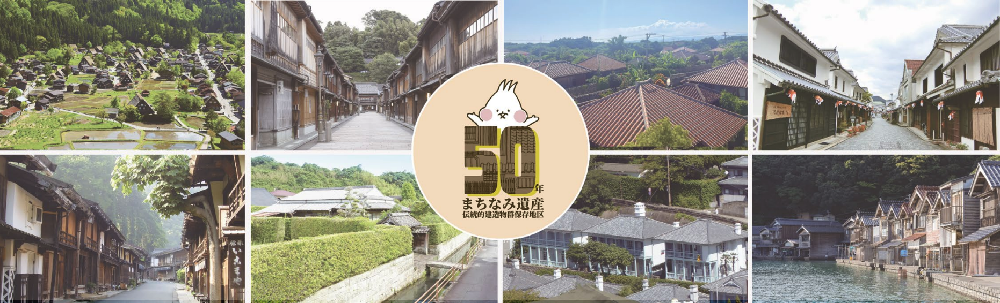
  <figcaption>https://www.bunka.go.jp/seisaku/bunkazai/bunkazai_50th.html</figcaption>
</figure>

---

## 伝建地区、重伝建地区とは？

- 崖の上のポニョ: 広島県福山市鞆町
- 映画「るろうに剣心」: 岡山県倉敷市倉敷川畔
- TVアニメ「氷菓」: 岐阜県高山市三町, 岐阜県高山市下二之町

etc

---

## 伝建地区、重伝建地区とは？

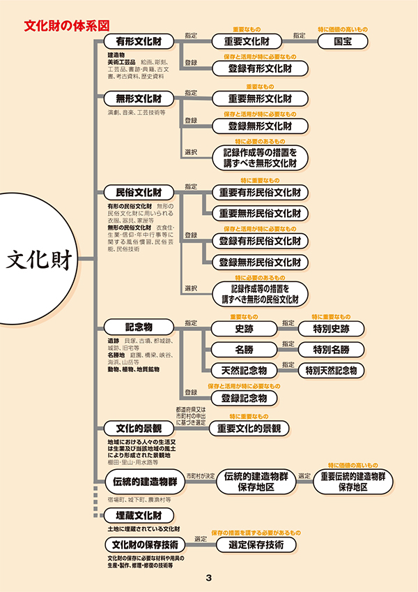

伝建地区
- 歴史的集落・町並みを保存している地区
  - 建造物群
  - 周囲の環境(樹林、池、庭園など)
- 市町村が主体となって保存している
- 現状変更に規制が入る（外観のみ）
  - 凍結的保存ではなく、創造的保存、動態的保存を目指している

---

## 伝建地区、重伝建地区とは？

重伝建地区
- 市町村から申出を受けた伝建地区のうち、国が特に価値が高いと選定したもの
- 選定後の効果
  - 市町村が国庫から補助を受けられる（過疎地域65%／その他50%）
  - 文化財に対する税制優遇措置がある
  - （選定による規制の増減はない）

---

## 伝建地区、重伝建地区とは？

重伝建地区
- 選定基準
  1. 伝統的建造物群が全体として意匠的に優秀 なもの
  2. 伝統的建造物群及び地割がよく旧態を保持 しているもの
  3. 伝統的建造物群及びその周囲の環境が 地域的特色を顕著に示しているもの

---

## 伝建地区、重伝建地区の成り立ち

時期 | 出来事・背景 | 概要
--- | --- | ---
（高度経済成長期） | 歴史的環境の喪失が加速 | 自然環境の大規模破壊や公害の発生と並行して、歴史的環境の喪失が急速に進行。
1966年 | 「古都保存法」が成立 | 凍結的保存（＝開発行為を厳しく制限）を志向。原則として市街地・集落区域を除外したため、歴史的集落・町並みの保存制度にはならず。
（1966年前後） | 各地で地域独自の保存事業が始動 | 高山市の三之町保存会が発足するなど、各地の歴史的町並みで住民主体の保存活動が展開。
1970年 | 京都・奈良伝統文化シンポジウム（文化庁がユネスコと共催） | 歴史的地域の保存と開発を総合的に議論し、制度化を勧告。
1975年 | 文化財保護法を改正し制度化 | 建造物群が文化財の種別に追加。「伝統的建造物群保存地区」制度を創設。「選定基準」も定められた。

---

## 街並みの種類: 集落（山村集落・農村集落・島の農村集落）

地域の自然条件と生活様式に適応して発達した民家群が、土地ごとの独自性ある 景観を形成。

近代化で形態が変容しつつあり、歴史的環境を活かした保全と継承が求められる。

<!-- 岐阜県白川村荻町 -->
<figure class="scratch">
  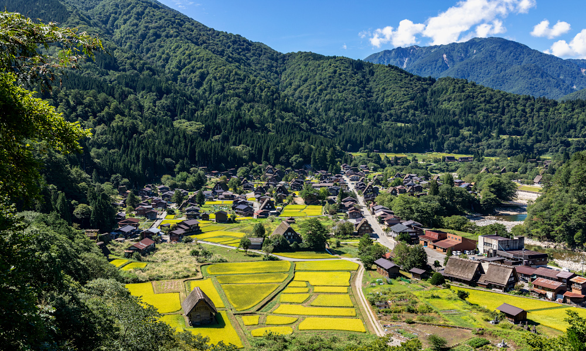
  <figcaption>https://www.denken.gr.jp/archive/shirakawa-ogimachi/index.html</figcaption>
</figure>

---

## 街並みの種類: 宿場の町並み（宿場町・講中塾）

街道交通の拠点として本陣・旅籠・問屋場が整備され、物流と人の往来で栄えた。

鉄道以後は機能を失ったが、歴史的景観を核に観光資源として再生している。

<!-- 長野県南木曽町妻籠宿 -->
<figure class="scratch">
  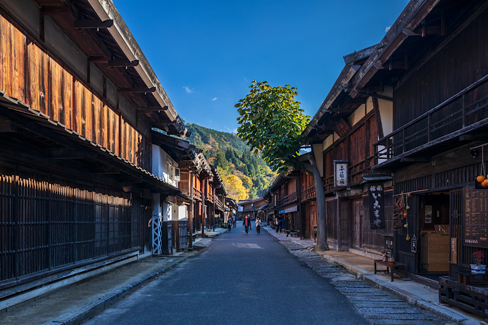
  <figcaption>https://www.denken.gr.jp/archive/nagiso-tsumagojuku/index.html</figcaption>
</figure>

---

## 街並みの種類: 港と結びついた町並み（港町）

海運と文化交流の要地として繁栄し、異国文化の受容により洋館や教会を含む 独特の街並みが生まれた。

現在も当時の賑わいと国際性を想起させる景観を残す。

<!-- 神戸市北野町山本通 -->
<figure class="scratch">
  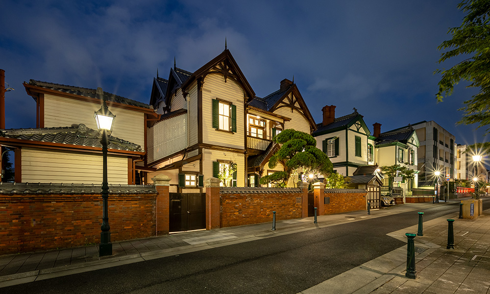
  <figcaption>https://www.denken.gr.jp/archive/kobe-kitanochoyamamotodouri/index.html</figcaption>
</figure>

---

## 街並みの種類: 商家の町並み（商家町・在郷町）

水運や交通の結節点に商業が集積し、塗屋造りや土蔵を備えた重厚な町家が 軒を連ねる。

農村にありつつ都市機能をもつ在郷町も生まれ、地域経済の中核を担った。

<!-- 岡山県倉敷市倉敷川畔 -->
<figure class="scratch">
  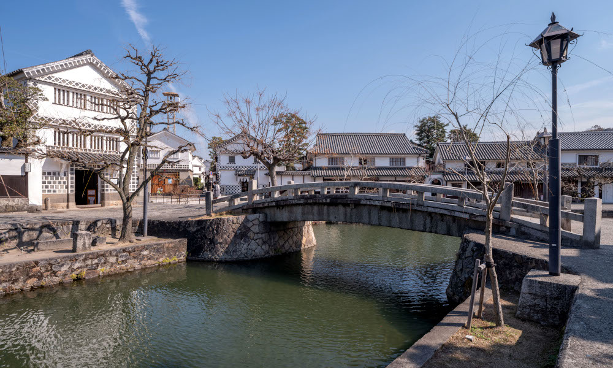
  <figcaption>https://www.denken.gr.jp/archive/kurashiki-kurashikigawahan/index.html</figcaption>
</figure>

---

## 街並みの種類: 産業と結びついた町並み（養蚕町・鉱山町・製塩町・製蝋町・製磁町）

特産品の製造や採掘で富を蓄え、職人集団と高度な技術が良質で大規模な 建造物群を形成した。

工房や道具類などの民俗資料が残り、産業史を物語る。

<!-- 長野県東御市海野宿 -->
<figure class="scratch">
  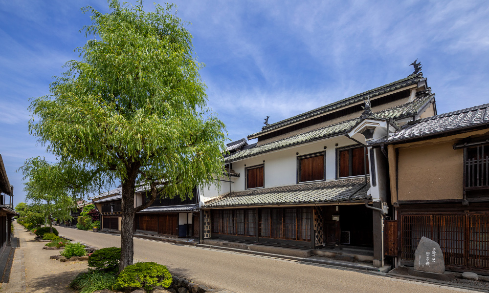
  <figcaption>https://www.denken.gr.jp/archive/toumi-unnojuku/index.html</figcaption>
</figure>

---

## 街並みの種類: 社寺を中心とした町並み（門前町・寺内町・里坊群・社家町）

参詣・宿泊・物販需要に支えられて社寺の周辺に市街が発達し、宗教空間と生活 空間が重層する独自の構成を持つ。
今日では静謐な景観を維持しつつ歴史的価値を伝える。

<!-- 京都市産寧坂 -->
<figure class="scratch">
  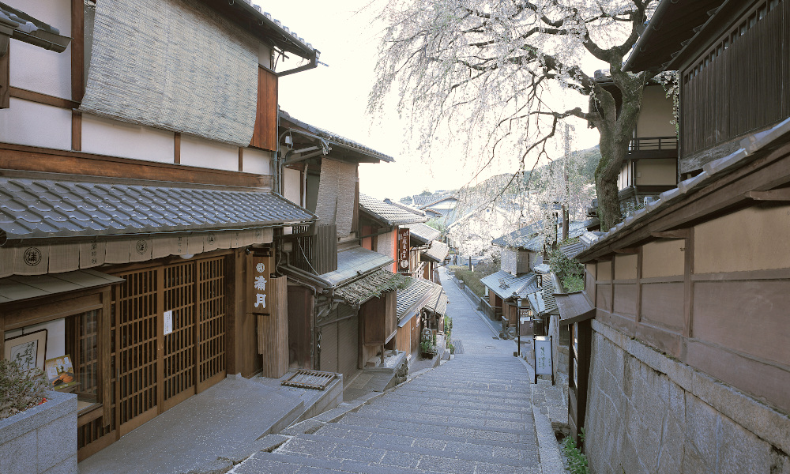
  <figcaption>https://www.denken.gr.jp/archive/kyoto-sanneizaka/index.html</figcaption>
</figure>

---

## 街並みの種類: 茶屋の町並み（茶屋町）

町人文化と社交の場として形成され、料亭・茶屋・芸能が集まり洗練された 歓楽景観を築いた。

現在も伝統的な接客文化と都市観光の核として機能する地域がある。

<!-- 京都府京都市祇園新橋 -->
<figure class="scratch">
  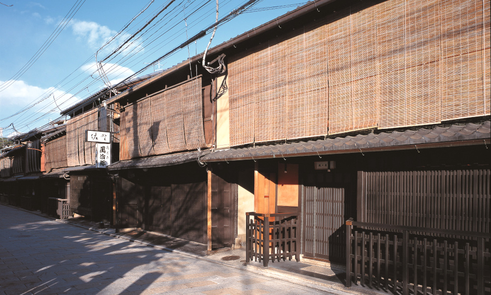
  <figcaption>https://www.denken.gr.jp/archive/kyoto-gionshinbashi/index.html</figcaption>
</figure>

---

## 街並みの種類: 武家を中心とした町並み（城下町・武家町）

城郭を中心に武家地・町人地・寺社地を計画配置した防御・統治都市で、屈折した街路や石垣など軍事的配慮が特徴。

近世解体後も多くの現代都市の基層となり、武家屋敷景観は一部で良好に残存する。

<!-- 山口県萩市堀内地区 -->
<figure class="scratch">
  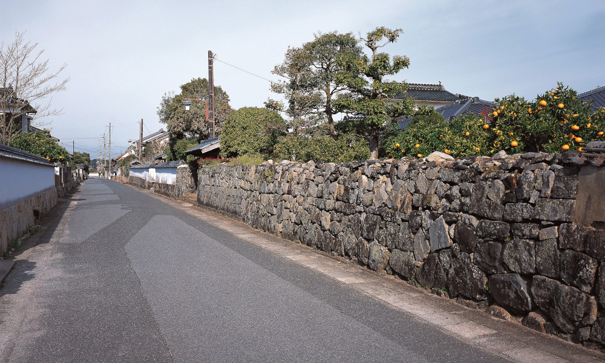
  <figcaption>https://www.denken.gr.jp/archive/hagi-horiuchichiku/index.html</figcaption>
</figure>

---

## 沖縄の重伝建地区: 竹富町竹富島

- 空間構造が特徴的
  - 中心部に集落、同心円状に樹林地・農地、砂浜、珊瑚、外海
- 重伝建地区以外にも文化財に溢れているよう

<figure class="scratch">
  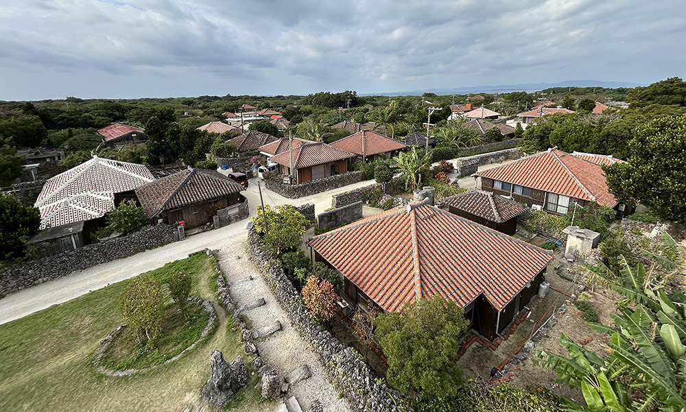
  <figcaption>https://www.denken.gr.jp/archive/taketomi-taketomijima/index.html</figcaption>
</figure>

---

## 沖縄の重伝建地区: 渡名喜村渡名喜島

- 家並みが特徴的
  - 特有の地割り、道より低い屋敷、福木に囲まれた赤瓦の家屋
- 日常的にウミガメが見れる、県立自然公園があるなど、自然に恵まれている

<figure class="scratch">
  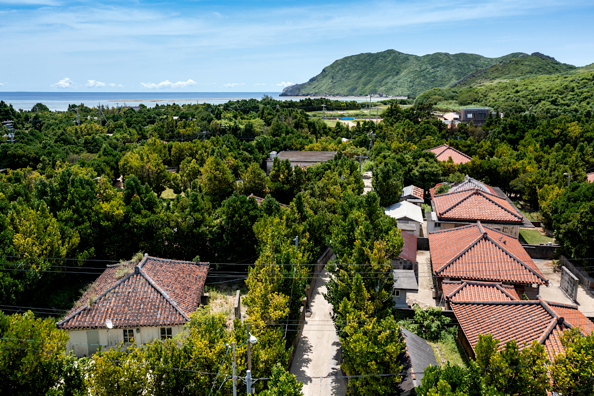
  <figcaption>https://www.denken.gr.jp/archive/tonaki-tonakijima/index.html</figcaption>
</figure>

---

<!-- _class: reference -->

## 参考

  - "歴史的集落・町並みの保存 : 重要伝統的建造物群保存地区ガイドブック"
  [CiNii図書](https://ci.nii.ac.jp/ncid/BA5044761X)
  - "日本伝統の町 : 重要伝統的建造物群保存地区62"
  [CiNii図書](https://ci.nii.ac.jp/ncid/BA6729792X)
  - "伝統的建造物群保存地区 | 文化庁"
  https://www.bunka.go.jp/seisaku/bunkazai/shokai/hozonchiku/
  - "概要 | 文化庁"
  https://www.bunka.go.jp/seisaku/bunkazai/shokai/gaiyo/
  - "歴史的町並みの保存・整備・活用『全国伝統的建造物群保存地区協議会（伝建協）』|町並みアーカイブ"
  https://www.denken.gr.jp/archive/

